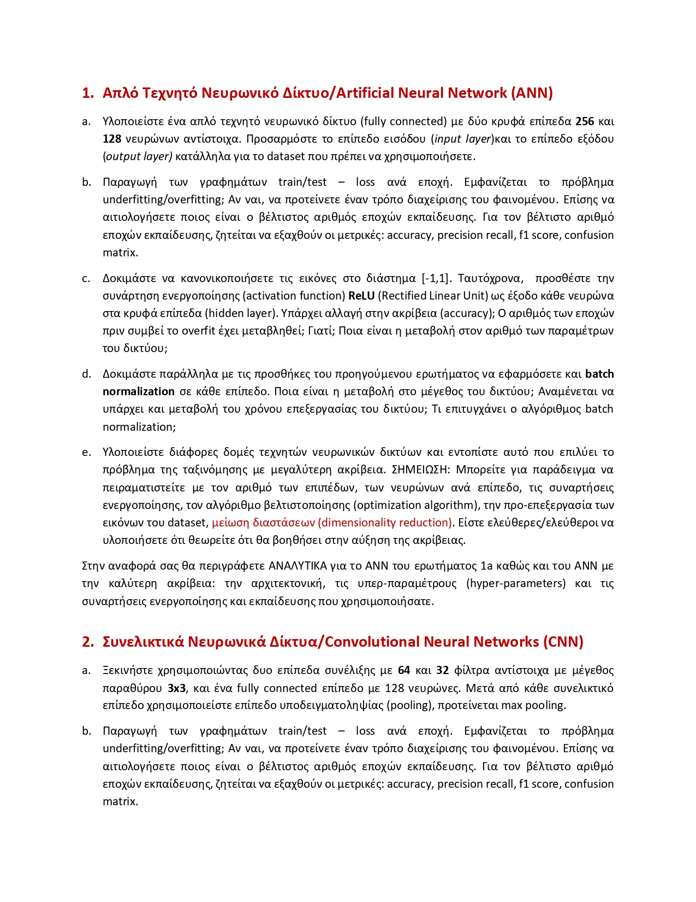

# Pattern-Recognition

### **ATTENTION: This repository contains part of the Fruits-360 Dataset (400MB)**

Student: Samoladas Triantafyllos  
Course: Pattern Recognition  
University: Democritus University of Thrace  
 
  
  
  
  
  
